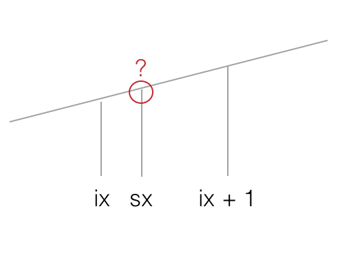
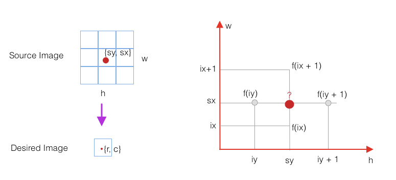

## How does Darknet resize the image ? 

```
./detect cfg/yolov3.cfg yolov3.weights data/dog.jpg 
```
When you run this command, it does these things: 

1. parse the config file 
2. construct the neural network 
3. load the weight file 
4. load image and resize it to fit the network input size
5. network predict bounding boxes
6. use non-maximum suppression algorithm to choose best box


### load image 

In the step 4, it rearranges the image data by transforming the 3 dimensions input volume into an array. 


```c++
image load_image_stb(char *filename, int channels)
{
    int w, h, c;
    unsigned char *data = stbi_load(filename, &w, &h, &c, channels);
    if (!data) {
        fprintf(stderr, "Cannot load image \"%s\"\nSTB Reason: %s\n", filename, stbi_failure_reason());
        exit(0);
    }
    if(channels) c = channels;
    int i,j,k;
    image im = make_image(w, h, c);
    for(k = 0; k < c; ++k){
        for(j = 0; j < h; ++j){
            for(i = 0; i < w; ++i){
                int dst_index = i + w*j + w*h*k;
                int src_index = k + c*i + c*w*j;
                im.data[dst_index] = (float)data[src_index]/255.;
            }
        }
    }
    free(data);
    return im;
}

```

### Bilinear Interpolation

As for resizing the input image, we should talk something about Bilinear Interpolation.

```c++
/**
 * Using Bilinear Interpolation to resize the image
 * @param im the source image
 * @param w the width of the destination image
 * @param h the height of the destination image
 * @return
 */
image resize_image(image im, int w, int h)
{
    image resized = make_image(w, h, im.c);   
    image part = make_image(w, im.h, im.c);
    int r, c, k;
    // the ratio of the width of the source image and the width of the destination image
    float w_scale = (float)(im.w - 1) / (w - 1);
    // the ratio of the height of the source image and the height of the destination image
    float h_scale = (float)(im.h - 1) / (h - 1);
    // linear interpolation, estimate what the pixel value is for sx  (ix <= sx < ix +1)
    // resize the width of source image to the width of desired image
    for(k = 0; k < im.c; ++k){
        for(r = 0; r < im.h; ++r){
            // w is the width of the desired image, c is the index of the pixel in the desired image
            for(c = 0; c < w; ++c){
                float val = 0;
                if(c == w-1 || im.w == 1){
                    val = get_pixel(im, im.w-1, r, k);
                } else {
                    // get the index  for the source image related to the index c for a desired image
                    float sx = c*w_scale;
                    int ix = (int) sx;
                    float dx = sx - ix;
                    // Linear interpolation. A straight line through (ix, f(ix)), (ix+1, f(ix+1)) satisfies
                    // f(x) = f(ix) + [f(ix+1) - f(ix)] / [(ix+1) - ix]; If we set x equal to sx (ix <= sx < ix +1); then
                    // f(sx) = f(ix) + [f(ix + 1) - f(ix)] / [(ix+1) -ix]
                    val = (1 - dx) * get_pixel(im, ix, r, k) + dx * get_pixel(im, ix+1, r, k);
                }
                set_pixel(part, c, r, k, val);
            }
        }
    }
    // linear interpolation, estimate what the pixel value is for sy (iy <= sy < iy + 1)
    // resize the height of source image to the height of desired image
    for(k = 0; k < im.c; ++k){
        // h is the height of the desired image
        for(r = 0; r < h; ++r){
            float sy = r*h_scale;
            int iy = (int) sy;
            float dy = sy - iy;
            for(c = 0; c < w; ++c){
                float val = (1-dy) * get_pixel(part, c, iy, k);
                set_pixel(resized, c, r, k, val);
            }
            if(r == h-1 || im.h == 1) continue;
            for(c = 0; c < w; ++c){
                float val = dy * get_pixel(part, c, iy+1, k);
                add_pixel(resized, c, r, k, val);
            }
        }
    }

    free_image(part);
    return resized;
}

```

Basically, it is linear interpolation in both X and Y directions (or width and height directions). For each pixel, it estimates the value of a pixel by using 4 other known neighboring pixel values.

1. We should know the ratio of the source image width(height) to the desired image width(height). It is `w_scale` and `h_scale` in the code. 
2. Estimate desired pixel values using Linear Interpolation in the width direction. 
  2.1 For each desired pixel with index c in the w direction, we get the related index value sx for the source image. 
  2.2 sx is a float value, `ix <= sx <= ix + 1`
  2.3 calculate the pixel value at index c using Lineaer Interpolation formula. 
   $$ f(sx) = f(ix) + \frac{f(ix + 1) - f(ix)} {(ix+1) -ix} $$ 



where f(ix + 1) equal to the result of get_pixel(im, ix + 1, r, k), f(ix) equal to the result of get_pixel(im, ix, r, k). We estimate every pixel value iteratively for desired image by applying linear interpolation in the w direction of the source image. 
 
 3. We applying linear interpolation in the height direction. 
